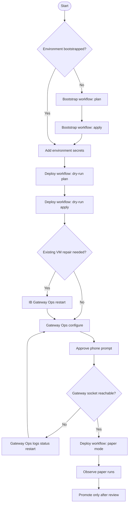

# Workflow execution runbook

This runbook shows the order for the repository workflows, the Auto CI/CD gateway checks, and the recovery path for an existing VM.

## Flowchart

## Main sequence

| Step | Workflow | Use when | Result |
|---|---|---|---|
| 1 | Bootstrap GCP Workload Identity Federation: plan | First setup for an environment | Preview cloud identity setup |
| 2 | Bootstrap GCP Workload Identity Federation: apply | Bootstrap plan is acceptable | Writes generated deploy config |
| 3 | Discover Telegram chat ID | Chat id is unknown | Finds alert destination |
| 4 | Deploy GCP e2-micro VM: plan | Runtime secrets are set | Preview VM/app changes |
| 5 | Deploy GCP e2-micro VM: apply with dry run | Plan is acceptable | Creates or updates VM and app |
| 6 | IB Gateway Ops: restart | Existing VM has stale helper or missing service | Repairs helpers and restarts Gateway service |
| 7 | IB Gateway Ops: configure-paper | VM is healthy and broker login secrets are set | Configures Gateway paper session |
| 8 | Deploy GCP e2-micro VM: paper | Gateway socket is reachable | Runs app against paper account |
| 9 | IB Gateway Ops: logs/status/restart/verify-socket | Maintenance or troubleshooting | Diagnoses or restarts Gateway |

## Recovery map

| Symptom | Run next |
|---|---|
| Helper command missing | IB Gateway Ops restart |
| IBC template missing | IB Gateway Ops restart |
| Gateway service unit missing | IB Gateway Ops restart |
| Socket not reachable | IB Gateway Ops logs, status, restart, verify-socket |

## Environment secrets summary

| Workflow | Secrets needed |
|---|---|
| Bootstrap | Temporary bootstrap service account key |
| Deploy | Telegram token, Telegram chat id, data provider key, account selector for selected mode |
| IB Gateway Ops `configure-paper` / `configure-live` | Broker login id and broker login secret |

## Safe dev path

Dev pull requests intentionally run the credentialed `configure-paper` Gateway check when deploy or Gateway paths changed. Keep a phone available to approve IBKR mobile 2FA during that job.

1. Bootstrap plan.
2. Bootstrap apply.
3. Discover Telegram chat id if needed.
4. Add dev runtime secrets.
5. Deploy dry-run plan.
6. Deploy dry-run apply.
7. Run IB Gateway Ops `restart` once for existing VMs that need helper/service repair.
8. Pull-request Auto CI/CD runs IB Gateway Ops `configure-paper` for credentialed dev paper validation.
9. Approve the IBKR mobile 2FA phone prompt when the dev `configure-paper` workflow reaches broker login.
10. Deploy paper mode.
