# Workflow execution runbook

This runbook shows which GitHub Actions workflow to run, when to run it, and what to do next for the low-cost GCP VM deployment.

## Quick decision flow

```mermaid
flowchart TD
  A([Start]) --> B{Is the GitHub Environment ready?}
  B -- No --> B1[Create dev/stg/prd GitHub Environments]
  B1 --> B2[Add temporary GCP_BOOTSTRAP_SERVICE_ACCOUNT_KEY]
  B2 --> C[Run Bootstrap GCP Workload Identity Federation: plan]
  C --> D{Plan OK?}
  D -- No --> D1[Fix bootstrap IAM/project inputs]
  D1 --> C
  D -- Yes --> E[Run Bootstrap GCP Workload Identity Federation: apply]
  E --> F[Confirm ops/deploy/environments/<env>.env exists]
  F --> G[Delete temporary bootstrap key]
  G --> H{Telegram chat id known?}

  B -- Yes --> H
  H -- No --> H1[Run Discover Telegram chat ID]
  H1 --> H2[Send fresh /start or message to the bot/chat]
  H2 --> I[Add runtime secrets]
  H -- Yes --> I

  I --> I1[Add TELEGRAM_BOT_TOKEN, TELEGRAM_CHAT_ID, FMP_API_KEY]
  I1 --> I2[Add IBKR_ACCOUNT_PAPER for paper mode]
  I2 --> I3[Add IBKR_LOGIN_ID and IBKR_LOGIN_SECRET if using workflow-based Gateway setup]
  I3 --> J[Run Deploy GCP e2-micro VM: plan, dry_run, fixture]
  J --> K{Plan OK?}
  K -- No --> K1[Fix deploy config/secrets/terraform]
  K1 --> J
  K -- Yes --> L[Run Deploy GCP e2-micro VM: apply, dry_run, fixture]
  L --> M{VM/app smoke test OK?}
  M -- No --> M1[Use Deploy logs and IB Gateway Ops logs/status]
  M1 --> L
  M -- Yes --> N{Gateway helper stale or configure failed before login?}

  N -- Yes --> N1[Run Refresh Gateway Helper]
  N1 --> O[Run IB Gateway Ops: configure-paper]
  N -- No --> O
  O --> P[Approve IBKR Mobile 2FA]
  P --> Q{Gateway socket reachable?}
  Q -- No --> Q1[Run IB Gateway Ops: logs/status/restart]
  Q1 --> O
  Q -- Yes --> R[Run Deploy GCP e2-micro VM: apply, paper]
  R --> S[Observe paper trading for at least one full trading week]
  S --> T{Ready for live?}
  T -- No --> S
  T -- Yes --> U[Add IBKR_ACCOUNT to protected live environment]
  U --> V[Run IB Gateway Ops: configure-live]
  V --> W[Approve IBKR Mobile 2FA]
  W --> X[Run Deploy GCP e2-micro VM: apply, live, allow_live_trading=true]
  X --> Y([Operate with alerts, reports, and periodic reviews])
```



## Workflow sequence by phase

| Phase | Workflow | Inputs | Run when | Expected result |
|---|---|---|---|---|
| 1. Bootstrap plan | **Bootstrap GCP Workload Identity Federation** | `deploy_environment=<env>`, `terraform_action=plan` | First time per environment, or after changing bootstrap inputs. | Terraform plan shows WIF/deployer setup. |
| 2. Bootstrap apply | **Bootstrap GCP Workload Identity Federation** | `deploy_environment=<env>`, `terraform_action=apply` | Bootstrap plan is clean. | Commits `ops/deploy/environments/<env>.env`; WIF deploy identity is ready. |
| 3. Telegram discovery | **Discover Telegram chat ID** | Usually environment-specific bot token/chat setup. | `TELEGRAM_CHAT_ID` is unknown. | Produces the chat id after you send a fresh message to the bot/chat. |
| 4. VM dry-run plan | **Deploy GCP e2-micro VM** | `terraform_action=plan`, `trading_mode=dry_run`, `data_provider=fixture`, `allow_live_trading=false` | Runtime secrets are present and bootstrap is complete. | Terraform/deploy plan validates. |
| 5. VM dry-run apply | **Deploy GCP e2-micro VM** | `terraform_action=apply`, `deploy_app=true`, `tailscale_enabled=true`, `trading_mode=dry_run`, `data_provider=fixture`, `allow_live_trading=false` | Dry-run plan is clean. | VM exists, app is uploaded, `.env` is rendered, cron is installed, smoke test runs. |
| 6. Helper refresh | **Refresh Gateway Helper** | `deploy_environment=<env>` | Existing VM has stale Gateway helper, or setup fails before broker login with missing local IBC files. | Reinstalls `/usr/local/bin/poma-configure-ibc` on the VM. |
| 7. Gateway paper setup | **IB Gateway Ops** | `action=configure-paper`, `deploy_environment=<env>` | VM dry-run is healthy and `IBKR_LOGIN_ID`/`IBKR_LOGIN_SECRET` are set. | Writes VM-local IBC config in paper mode, restarts Gateway, waits for `127.0.0.1:7497`. |
| 8. Paper deploy | **Deploy GCP e2-micro VM** | `terraform_action=apply`, `trading_mode=paper`, `data_provider=fmp` or `fixture`, `allow_live_trading=false` | Gateway paper socket is reachable and `IBKR_ACCOUNT_PAPER` is set. | Runtime `.env` uses paper account and app can execute paper trades. |
| 9. Gateway operations | **IB Gateway Ops** | `action=status`, `logs`, `restart`, or `verify-socket` | Gateway has issues, socket is unreachable, or you need diagnostics. | Shows/restarts Gateway service or verifies port `7497`. |
| 10. Live setup | **IB Gateway Ops** | `action=configure-live`, `deploy_environment=prd` | Paper has run successfully and you intentionally want live Gateway mode. | Writes VM-local IBC config in live mode and waits for Gateway socket. |
| 11. Live deploy | **Deploy GCP e2-micro VM** | `terraform_action=apply`, `trading_mode=live`, `allow_live_trading=true` | Live account secret is present, Gateway live mode is verified, and reports/limits were reviewed. | App runs in live mode. |

## Required secrets by workflow

| Workflow | Required GitHub Environment secrets |
|---|---|
| **Bootstrap GCP Workload Identity Federation** | `GCP_BOOTSTRAP_SERVICE_ACCOUNT_KEY` only for first bootstrap. Delete it after apply succeeds. |
| **Discover Telegram chat ID** | `TELEGRAM_BOT_TOKEN`. |
| **Deploy GCP e2-micro VM** | `TELEGRAM_BOT_TOKEN`, `TELEGRAM_CHAT_ID`, `FMP_API_KEY`; `TAILSCALE_AUTHKEY` when `tailscale_enabled=true`; `IBKR_ACCOUNT_PAPER` for paper deploys; `IBKR_ACCOUNT` for live deploys. |
| **Refresh Gateway Helper** | GCP WIF config generated by bootstrap. No IBKR broker login secret required. |
| **IB Gateway Ops configure-paper/live** | `IBKR_LOGIN_ID`, `IBKR_LOGIN_SECRET`; plus GCP WIF config generated by bootstrap. |

## Common recovery paths

### `poma-configure-ibc: command not found`

Run **Refresh Gateway Helper**, then rerun **IB Gateway Ops** with `configure-paper` or `configure-live`.

### `Missing IBC sample config at /opt/ibc/config.ini`

Run **Refresh Gateway Helper**. This overwrites the stale VM helper with the current repo helper that can create a minimal runtime config when the IBC sample file is missing.

### Gateway socket is not reachable

Run these **IB Gateway Ops** actions in order:

1. `logs`
2. `status`
3. `restart`
4. `verify-socket`
5. Rerun `configure-paper` or `configure-live` if the session needs fresh authentication.

### Paper account mismatch

For paper mode, all three must align:

```text
IB Gateway Ops action = configure-paper
Deploy trading_mode = paper
Runtime IBKR_ACCOUNT = rendered from IBKR_ACCOUNT_PAPER
```

For live mode, all three must align:

```text
IB Gateway Ops action = configure-live
Deploy trading_mode = live
Runtime IBKR_ACCOUNT = rendered from IBKR_ACCOUNT
```

## Safe default path for dev

Use this order for the normal dev setup:

1. **Bootstrap GCP Workload Identity Federation** — `plan`.
2. **Bootstrap GCP Workload Identity Federation** — `apply`.
3. **Discover Telegram chat ID** if the chat id is unknown.
4. Add dev secrets: `TELEGRAM_BOT_TOKEN`, `TELEGRAM_CHAT_ID`, `FMP_API_KEY`, `TAILSCALE_AUTHKEY`, `IBKR_ACCOUNT_PAPER`, `IBKR_LOGIN_ID`, `IBKR_LOGIN_SECRET`.
5. **Deploy GCP e2-micro VM** — `plan`, `dry_run`, `fixture`.
6. **Deploy GCP e2-micro VM** — `apply`, `dry_run`, `fixture`.
7. **Refresh Gateway Helper** — run once on existing/stale VMs.
8. **IB Gateway Ops** — `configure-paper`; approve IBKR Mobile 2FA.
9. **Deploy GCP e2-micro VM** — `apply`, `paper`.
10. Use **IB Gateway Ops** `logs/status/restart/verify-socket` for maintenance.

## Live gate

Do not run live until all of these are true:

- Paper mode has completed at least one full trading week.
- The latest rebalance report has been reviewed.
- Order caps, turnover caps, position caps, and Telegram alerts are verified.
- `IBKR_ACCOUNT` is configured only in the protected environment intended for live trading.
- You intentionally run `trading_mode=live` and `allow_live_trading=true`.
